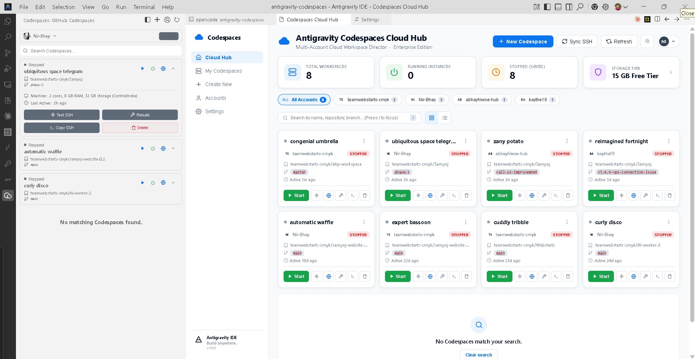

<div align="center">


# Antigravity Codespaces Pro

**Enterprise multi-account GitHub Codespaces manager for Antigravity IDE & Code-OSS.**
Connect, start, stop, rebuild, and monitor every cloud dev environment across all your GitHub accounts — in one click.

[](https://marketplace.visualstudio.com/items?itemName=nirbhay-hiwse.antigravity-codespaces)
[](https://open-vsx.org/extension/nirbhay-hiwse/antigravity-codespaces)
[](https://open-vsx.org/extension/nirbhay-hiwse/antigravity-codespaces)
[](https://github.com/Nir-Bhay/antigravity-codespaces/actions)
[](LICENSE)
[](https://github.com/Nir-Bhay/antigravity-codespaces/stargazers)

[**Open VSX Registry**](https://open-vsx.org/extension/nirbhay-hiwse/antigravity-codespaces) · [**Download VSIX**](https://github.com/Nir-Bhay/antigravity-codespaces/releases/latest) · [**Report Bug**](https://github.com/Nir-Bhay/antigravity-codespaces/issues) · [**Request Feature**](https://github.com/Nir-Bhay/antigravity-codespaces/issues/new)

</div>

---

## The Problem

GitHub Codespaces has a great browser UI — but if you use **Antigravity IDE**, **Code-OSS**, or any non-Microsoft editor, you get **zero native Codespaces support**. No sidebar, no dashboard, no SSH management, no lifecycle controls.

You're left copying SSH commands from the browser, hand-editing `~/.ssh/config`, and watching long-running AI agent sessions die on WebSocket timeouts.

**Antigravity Codespaces Pro fixes all of that in one extension.**

---

## Showcase — v5 UI

> Real screenshot: Activity Bar sidebar (live Codespace list, machine specs, SSH action dock) + Cloud Hub dashboard — 8 workspaces across 4 GitHub accounts, KPI strip (Total / Running / Stopped / Storage tier), account chips, live search, grid/list views, and per-card Start / Test SSH / Open Web / Rebuild / Copy SSH / Delete controls.



---

## What's New in v5.0.1

### Security hardening
- **SSH config injection protection** — Codespace names are allowlist-validated before any `~/.ssh/config` write; block removal uses escaped matching with explicit end markers.
- **Webview XSS sweep** — every machine/ports/repository injection point is HTML-escaped.
- **Shell-free CLI runner** — all `gh` calls go through `execFile` argv (no shell), stdout-only capture, child processes killed on timeout.

### Dashboard correctness
- Error-page **Retry button works**, plus an instant **loading skeleton** (no more blank panel).
- **Sign In call-to-action** when logged out instead of a dead end; per-account load failures show as **banners**.
- **Search, account filter, and grid/list mode survive refreshes**; all accounts load **in parallel**.
- Start / Stop / Delete / Rebuild / Connect / Sync now **refresh the dashboard too** — and login/logout refreshes every surface automatically.

### Reliability
- PAT accounts **stay visible offline** (lazy re-verify, 10-minute TTL); the active account is **never auto-switched** behind your back.
- `stop` / `rebuild` timeouts match real operation durations (30s / 180s); expired-auth and rate-limit errors **surface clearly** instead of failing silently.
- Repository and Codespace lists **paginate to 500** (no more 100-item cap); `owner/repo` input is validated; status bar updates are **debounced**.

See [CHANGELOG.md](CHANGELOG.md) for the full list.

---

## Features

### ⚡ One-Click Quick Connect — `Alt+C`

Press `Alt+C` anywhere. A fuzzy-search launcher lists every Codespace across **all accounts** (online first, then by recent use). Enter — connected in seconds.

### 🖥️ Cloud Hub Dashboard

Full-window management console:
- **KPI strip** — Total workspaces, Running instances, Stopped (saved), Storage tier
- **Account chips** — filter per account or view All
- **Live search** (`/` to focus, `Esc` to clear) across name, repository, and branch
- **Grid + List views**, theme toggle (light/dark, persisted)
- **4-step Create wizard** — account → repository (search + manual `owner/repo` entry) → branch (empty = default) → provisioning, with error recovery
- **Rebuild / Delete modals** with explicit confirmation

### 🔑 Triple Auth, Multi-Account

Sign in your way — **native VS Code GitHub OAuth** (zero terminal popups), **Personal Access Token** (encrypted in `context.secrets`, per-account keys), or **GitHub CLI**. Every account is queried in parallel with isolated tokens; switching accounts never disturbs the others.

### 🤖 AI Agent KeepAlive

`ServerAliveInterval` + `TCPKeepAlive` are injected into every SSH host block, keeping long autonomous sessions alive. Tune both from settings; tip: `15` / `20` for maximum stability.

### 🔗 Automated SSH Config Engine

Startup (and one-click Sync) writes clean, deduplicated blocks to `~/.ssh/config`:

```
# CS_ENTRY:<codespace-name>
Host cs.<name> cs-<account>-<owner>-<repo> <name>
  User codespace
  ProxyCommand "<gh>" cs ssh -c "<name>" --stdio
  ...
# END_CS_ENTRY:<name>
```

Atomic writes (temp + rename), automatic `.bak` backup, `0600` permissions.

### 🧪 SSH Latency Tester

Measures real tunnel round-trip in milliseconds before you commit to a connection — from sidebar, dashboard, or Command Palette.

### 🛠️ Full DevContainer Lifecycle

| Action | Description |
|---|---|
| **Turn ON** | Wake a stopped Codespace (cold boot) |
| **Stop** | Shut down to conserve billable hours |
| **Standard Rebuild** | Layer-cached devcontainer rebuild |
| **Full Clean Rebuild** | Wipe cache and rebuild from scratch |
| **Delete** | Modal-confirmed permanent removal |

### 🌐 Port Forwarding Discovery

Expand any sidebar card to see machine specs, last-active time, and **forwarded ports** with one-click browser links.

---

## Extension vs Browser Tab

| Capability | GitHub Browser Tab | **Antigravity Codespaces Pro** |
|---|:---:|:---:|
| Works in Antigravity IDE / Code-OSS | ❌ | ✅ |
| Multi-account, parallel + isolated | ❌ (one at a time) | ✅ |
| In-editor dashboard (grid + list) | ❌ | ✅ |
| Quick Connect launcher | ❌ | ✅ `Alt+C` |
| SSH config auto-sync + backup | ❌ | ✅ |
| AI agent KeepAlive | ❌ | ✅ |
| SSH latency tester | ❌ | ✅ |
| Status bar live count | ❌ | ✅ |
| Offline-tolerant auth | ❌ | ✅ |

---

## Architecture

```
╔══════════════════════════════════════════════════════════════════╗
║                         LOCAL WORKSTATION                        ║
║                                                                  ║
║  ┌─────────────────────┐      ┌──────────────────────────────┐   ║
║  │   Antigravity IDE   │      │     Codespaces Pro Engine    │   ║
║  │  ─────────────────  │      │  ──────────────────────────  │   ║
║  │  • Activity Sidebar │◄────►│  • AuthManager (OAuth/PAT/   │   ║
║  │  • Cloud Hub Panel  │ post │    CLI, per-account tokens)  │   ║
║  │  • Alt+C Launcher   │Message  • GithubApi (REST-first,   │   ║
║  │  • Status Bar Badge │      │    CLI fallback, TTL cache)  │   ║
║  └─────────┬───────────┘      │  • SSH Config Writer (atomic,│   ║
║            │                  │    allowlisted, backed up)    │   ║
║            │                  │  • KeepAlive Manager          │   ║
║            │                  └──────────────┬───────────────┘   ║
║            ▼                                 ▼                   ║
║     ~/.ssh/config  ◄──── gh cs ssh ProxyCommand                  ║
╚═════════════════════════╤════════════════════════════════════════╝
                          │  Encrypted tunnel (HTTPS 443)
                          ▼
╔══════════════════════════════════════════════════════════════════╗
║                  GITHUB CODESPACES VM (Cloud)                    ║
║   • devcontainer  • remote host  • forwarded ports               ║
╚══════════════════════════════════════════════════════════════════╝

Data flow:  Auth → parallel REST list (30s TTL) → webview render (nonce CSP,
escaped HTML, getState persistence) → action → REST/CLI mutation → cache
invalidate → sidebar + dashboard + status bar refresh.
```

---

## Installation

### Option A — Open VSX Registry *(1 click, recommended)*

Search **"Antigravity Codespaces Pro"** in the Extensions panel and hit Install.

### Option B — VSIX from Releases

Download from [Releases](https://github.com/Nir-Bhay/antigravity-codespaces/releases/latest), then:

```powershell
antigravity-ide --install-extension antigravity-codespaces-5.0.1.vsix
```

Or inside the IDE: `Ctrl+Shift+P` → **Extensions: Install from VSIX...** → pick the file.

### Prerequisites

1. **GitHub CLI** (SSH proxy + fallback API):
   ```powershell
   winget install --id GitHub.cli
   ```
2. **Antigravity IDE** or any Code-OSS / Open VSX compatible editor.
3. **Remote SSH extension** *(recommended)* — *Open Remote SSH* for automatic remote folder mounting after connect.

### Step 1 — Sign In (pick any)

- **Easiest:** click the cloud icon → **Sign In with GitHub** (native OAuth, no terminal).
- **PAT:** Quick Actions Menu → *Use Personal Access Token* (classic `ghp_` / fine-grained `github_pat_`, stored encrypted).
- **CLI:** `gh auth login -s codespace -w` (repeat per account).

### Step 2 — Open the Sidebar

Click the **cloud icon** in the Activity Bar. Accounts auto-discover and Codespaces list immediately. Press `Alt+C` anytime to jump straight to a machine.

---

## Configuration

```json
{
  "antigravity-codespaces.autoSyncSSHOnStartup": true,
  "antigravity-codespaces.showStatusBarItem": true,
  "antigravity-codespaces.serverAliveInterval": 30,
  "antigravity-codespaces.serverAliveCountMax": 10,
  "antigravity-codespaces.defaultRemoteFolder": "/workspaces/${repo}"
}
```

| Setting | Default | Description |
|---|:---:|---|
| `autoSyncSSHOnStartup` | `true` | Write SSH host blocks to `~/.ssh/config` on launch |
| `showStatusBarItem` | `true` | Live online-count badge in the status bar |
| `serverAliveInterval` | `30` | SSH keepalive ping interval (seconds, clamped 5–300) |
| `serverAliveCountMax` | `10` | Missed pings before drop (clamped 1–100) |
| `defaultRemoteFolder` | `/workspaces/${repo}` | Remote folder on connect (`${repo}` / `${name}` supported) |

---

## Command Reference

All commands via `Ctrl+Shift+P`:

| Command | Shortcut | Description |
|---|:---:|---|
| **Quick Connect to Codespace** | `Alt+C` | Fuzzy-search every Codespace, connect instantly |
| **Open Cloud Hub Dashboard** | — | Full grid/list management console |
| **Open Quick Actions Menu** | — | One launcher for all common actions |
| **Create New Codespace** | — | 4-step wizard (account → repo → branch → provision) |
| **Switch GitHub Account** | — | Change the active account |
| **Login to GitHub Account** | — | Native OAuth sign-in |
| **Sync SSH Config** | — | Rewrite all host blocks (with backup) |
| **Test SSH Connectivity** | — | Measure tunnel latency in ms |
| **Turn ON / Stop** | — | Wake or shut down a container |
| **Rebuild Container** | — | Standard (cached) or full clean rebuild |
| **Delete Codespace** | — | Modal-confirmed permanent deletion |
| **Copy SSH Command** | — | Copy `gh cs ssh -c <name>` |
| **Open in Browser** | — | Open in the GitHub web editor |
| **Refresh** | — | Re-query all accounts |

---

## DevContainer Setup for Best Compatibility

Add the SSH feature to `.devcontainer/devcontainer.json` so the remote host starts cleanly over SSH:

```json
{
  "name": "My Project",
  "image": "mcr.microsoft.com/devcontainers/base:ubuntu-24.04",
  "features": {
    "ghcr.io/devcontainers/features/sshd:1": { "version": "latest" }
  }
}
```

---

## Troubleshooting

<details>
<summary><strong>Initial connection takes 30–40 seconds</strong></summary>

Normal on cold boot — GitHub spins the container from scratch. Later connections, edits, and terminals are instant.

</details>

<details>
<summary><strong>"gh: command not found"</strong></summary>

Install GitHub CLI and restart the IDE. The extension works REST-first, so listing still functions — only the SSH fallback needs `gh`.

```powershell
winget install --id GitHub.cli
```

</details>

<details>
<summary><strong>WebSocket drops during AI agent sessions</strong></summary>

Lower the keepalive and re-sync:

```json
{
  "antigravity-codespaces.serverAliveInterval": 15,
  "antigravity-codespaces.serverAliveCountMax": 20
}
```

Then `Ctrl+Shift+P` → **Sync SSH Config**.

</details>

<details>
<summary><strong>SSH host not found after sync</strong></summary>

Run **Sync SSH Config** manually, then verify `~/.ssh/config` contains a `# CS_ENTRY:<name>` block. Entry aliases look like `cs.<name>` (exact) and `cs-<account>-<owner>-<repo>`.

</details>

<details>
<summary><strong>Extension shows no Codespaces / auth expired</strong></summary>

Re-sign in (sidebar → account menu), or for CLI auth: `gh auth refresh -s codespace`. Rate-limited? Wait a few minutes — the extension now tells you explicitly instead of showing an empty list.

</details>

---

## FAQ

**Does it work without GitHub CLI?**
Yes for listing, start/stop, delete, create, and metadata (direct GitHub REST API). SSH proxy connections need `gh` installed.

**How many GitHub accounts can I connect?**
Unlimited — native OAuth, PATs, and CLI accounts merge into one list, each queried in parallel with isolated tokens.

**Is my token safe?**
PATs live in VS Code's encrypted secret storage (OS keychain), OAuth tokens are never cached to disk, and CLI output is captured stdout-only so warnings can't leak into credentials.

**Will it corrupt my `~/.ssh/config`?**
No — writes are atomic (temp file + rename), a `.bak` backup is kept, only the extension's own `# CS_ENTRY:` blocks are ever touched, and names are allowlist-validated.

**Which editors are supported?**
Antigravity IDE, VS Code, Code-OSS, VSCodium, Gitpod desktop — anything running the VS Code extension host with webview support (`^1.85.0`).

---

## Roadmap

- [x] Open VSX Registry listing
- [x] Offline-tolerant multi-account auth
- [x] Cloud Hub grid + list views
- [ ] Windows toast notifications on container status changes
- [ ] Org-level billing summary widget in the dashboard
- [ ] Live quota/billing API (currently shows static free-tier info)
- [ ] Devcontainer template picker for new Codespace creation
- [ ] VS Code Marketplace listing

---

## Developer Documentation

- 📖 **[Deep Audit & Complete Blueprint](docs/AUDIT_AND_BLUEPRINT.md)** — architectural audit, BUG-01…BUG-16 analysis, token security, release checklist.
- 🔍 **[Verified Review, 2nd Edition](REVIEW_VERIFIED_2026-09-04.md)** — every finding re-checked with proof-of-concept, false alarms corrected.
- 🧪 **Offline tests** — `npm test` (16 assertions, zero dependencies): CLI runner, SSH golden-file, cache/TTL logic, webview security contracts.

---

## Contributing

See [CONTRIBUTING.md](CONTRIBUTING.md) for setup and the PR process.

- 🐛 **Found a bug?** [Open an issue](https://github.com/Nir-Bhay/antigravity-codespaces/issues)
- 💡 **Have an idea?** [Start a discussion](https://github.com/Nir-Bhay/antigravity-codespaces/discussions)
- ⭐ **Like the extension?** Star the repo — it drives discovery on Open VSX and search.

---

## Keywords

`github-codespaces` · `remote-development` · `cloud-dev-environment` · `multi-account-github` · `ssh-config-manager` · `devcontainer-manager` · `antigravity-ide` · `code-oss` · `open-vsx` · `codespace-lifecycle` · `port-forwarding` · `ai-agent-keepalive` · `websocket-keepalive` · `remote-ssh` · `cloud-workspace` · `developer-productivity`

---

## License

MIT — see [LICENSE](LICENSE)

<div align="center">

Built with ❤️ by [Nirbhay hiwse](https://github.com/Nir-Bhay)

**[GitHub](https://github.com/Nir-Bhay/antigravity-codespaces) · [Open VSX](https://open-vsx.org/extension/nirbhay-hiwse/antigravity-codespaces) · [Report Bug](https://github.com/Nir-Bhay/antigravity-codespaces/issues)**

</div>
