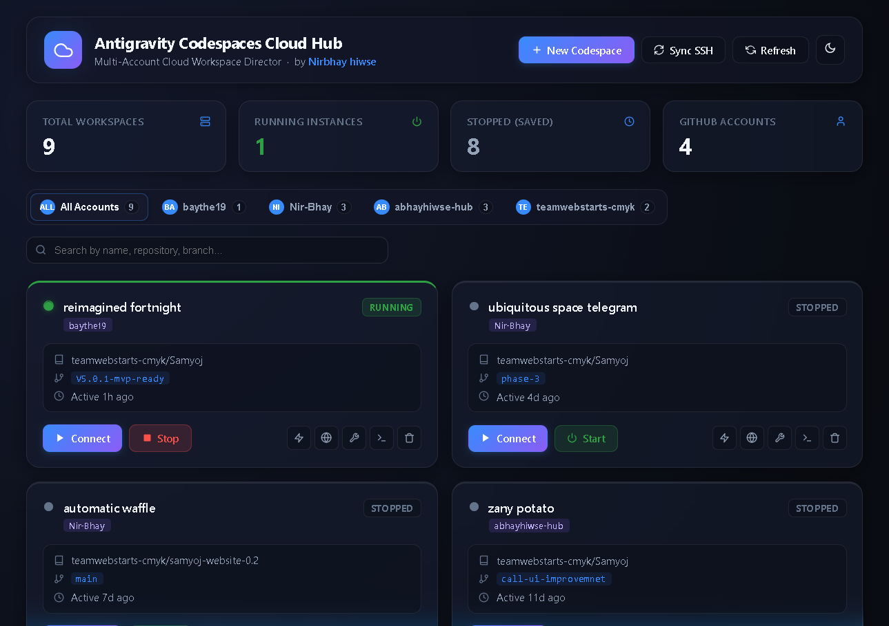
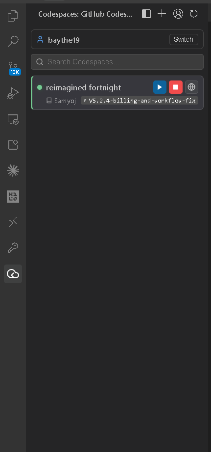

<div align="center">


# Antigravity Codespaces Pro

**Enterprise multi-account GitHub Codespaces manager for Antigravity IDE & Code-OSS**

[](https://github.com/Nir-Bhay/antigravity-codespaces/releases)
[](LICENSE)
[](https://open-vsx.org/extension/nirbhay-hiwse/antigravity-codespaces)
[](https://github.com/Nir-Bhay/antigravity-codespaces)
[](https://github.com/Nir-Bhay/antigravity-codespaces/stargazers)

[**Install VSIX**](https://github.com/Nir-Bhay/antigravity-codespaces/releases/latest) · [**Report Bug**](https://github.com/Nir-Bhay/antigravity-codespaces/issues) · [**Request Feature**](https://github.com/Nir-Bhay/antigravity-codespaces/issues/new)

</div>

---

## The Problem

GitHub Codespaces has a great browser-based UI — but if you use **Antigravity IDE**, **Code-OSS**, **Gitpod**, or any non-Microsoft VS Code build, you get **zero native extension support**. No sidebar, no connection UI, no SSH management, no lifecycle controls.

You're left copying SSH commands from the browser, managing config files by hand, and watching long-running AI agent sessions drop because of WebSocket timeouts.

**Antigravity Codespaces Pro** fixes all of that in one extension.

---

## Screenshots

### Cloud Hub Dashboard

> Full-page Bento Grid management console — real data: 9 total workspaces, 1 running instance, 8 stopped, 4 GitHub accounts. Live search, per-account tabs, and inline Connect / Stop / Start controls on every card.



### Activity Bar Sidebar

> Persistent sidebar in Antigravity IDE — shows the active account (`baythe19`), live Codespace list with green status dot, repo name, branch, and action buttons (Connect, Stop, Open in Browser) directly inline.



---

## Features

### ⚡ One-Click Quick Connect — `Alt+C`

Press `Alt+C` from anywhere in the editor. A fuzzy-search launcher appears listing every Codespace across all your accounts. Select one, hit Enter — you're connected in under 5 seconds.

### 🖥️ Cloud Hub Bento Dashboard

A full-window webview dashboard with:
- **Top metric strip** — Total environments, Online count, Inactive count, Connected accounts
- **Per-account tabs** — Switch between `baythe19`, `Nir-Bhay`, `abhayhiwse-hub`, or view All
- **Live search** — Filter by name, repo, branch, or machine type in real time
- **Bento Cards** — Each card shows status pulse, vCPUs, RAM, region, branch, last active time, and a full action dock

### 🔑 Multi-Account, Zero Token Collision

The extension queries every authenticated GitHub account in parallel using isolated Bearer Tokens (`GH_TOKEN`). Your active local `git` credentials never get touched. No global CLI account hopping, no session conflicts.

### 🤖 AI Agent Connection KeepAlive

Long autonomous AI sessions need stable WebSockets. The extension injects `ServerAliveInterval` and `TCPKeepAlive` into every SSH host block, preventing the connection drops that kill mid-task agents.

### 🔗 Automated SSH Config Engine

On startup, the extension writes clean, deduplicated `Host cs-<name>` blocks to `~/.ssh/config` — ready for native OpenSSH, external terminals, and any remote editor plugin. No manual editing required.

### 🧪 SSH Latency Tester

Built-in tunnel health check that measures real roundtrip ping in milliseconds before you commit to a connection. Available from the sidebar, dashboard, or Command Palette.

### 🛠️ Full DevContainer Lifecycle

| Action | Description |
|---|---|
| **Turn ON** | Wake a stopped Codespace (cold boot) |
| **Stop** | Shut down to conserve GitHub billable hours |
| **Standard Rebuild** | Layer-cached devcontainer rebuild |
| **Full Clean Rebuild** | Wipe cache and rebuild from scratch |
| **Delete** | Confirmation-gated permanent removal |

### 🌐 Port Forwarding Discovery

Scans running containers for forwarded ports and provides direct `http://localhost:<port>` links to open in your browser.

---

## Extension vs Native Codespaces Tab

| Capability | Native GitHub Tab (Browser) | **Antigravity Codespaces Pro** |
|---|:---:|:---:|
| Works in Antigravity IDE | ❌ | ✅ |
| Works in Code-OSS / Gitpod | ❌ | ✅ |
| Multi-account management | ❌ (one at a time) | ✅ (parallel, isolated) |
| SSH Config auto-sync | ❌ | ✅ |
| AI Agent KeepAlive | ❌ | ✅ |
| In-editor Dashboard | ❌ | ✅ Bento Grid |
| Keyboard Quick Connect | ❌ | ✅ Alt+C |
| SSH Latency Tester | ❌ | ✅ |
| Status Bar live count | ❌ | ✅ |

---

## Architecture

```
╔════════════════════════════════════════════════════════════╗
║                    LOCAL WORKSTATION                       ║
║                                                            ║
║  ┌──────────────────────┐   ┌──────────────────────────┐   ║
║  │   Antigravity IDE    │   │  Codespaces Pro Engine   │   ║
║  │  ─────────────────   │   │  ──────────────────────  │   ║
║  │  • Activity Sidebar  │◄─►│  • Token-Isolated API    │   ║
║  │  • Cloud Hub Dash    │   │  • SSH Config Writer     │   ║
║  │  • Alt+C Launcher    │   │  • KeepAlive Manager     │   ║
║  │  • Status Bar Badge  │   │  • Port Scanner          │   ║
║  └──────────┬───────────┘   └──────────┬───────────────┘   ║
║             │                          │                   ║
║             ▼                          ▼                   ║
║      ~/.ssh/config  ◄──── gh cs ssh ProxyCommand          ║
╚══════════════════════════╤═════════════════════════════════╝
                           │  Encrypted SSH Tunnel (443)
                           ▼
╔════════════════════════════════════════════════════════════╗
║             GITHUB CODESPACES VM  (Cloud)                  ║
║  • devcontainer  • Antigravity Remote Host  • Ports        ║
╚════════════════════════════════════════════════════════════╝
```

---

## Installation

### Prerequisites

**1. GitHub CLI** — Required for Codespaces API and SSH proxy:
```powershell
winget install --id GitHub.cli
```

**2. Antigravity IDE** or any Code-OSS / Open VSX compatible editor.

**3. Remote SSH Extension** *(recommended)* — *Open Remote SSH* or *VSX Remote SSH* for automatic remote folder mounting after connect.

---

### Step 1 — Authenticate Your GitHub Account(s)

```bash
# Primary account (grant codespace scope)
gh auth login -s codespace -w

# Repeat for every additional account you want to manage
gh auth login -s codespace -w
```

---

### Step 2 — Install the Extension

**Option A — Install from VSIX** *(recommended)*

Download from [Releases](https://github.com/Nir-Bhay/antigravity-codespaces/releases/latest), then:

```powershell
antigravity-ide --install-extension antigravity-codespaces-4.3.0.vsix
```

Or inside the IDE: `Ctrl+Shift+P` → **Extensions: Install from VSIX...** → pick the file.

**Option B — Open VSX Registry**

Search **"Antigravity Codespaces Pro"** in the Extensions panel (Open VSX compatible editors).

---

### Step 3 — Open the Sidebar

Click the **cloud icon** in the Activity Bar. The extension auto-discovers all authenticated accounts and lists your Codespaces immediately.

---

## Configuration

```json
{
  "antigravity-codespaces.autoSyncSSHOnStartup": true,
  "antigravity-codespaces.showStatusBarItem": true,
  "antigravity-codespaces.serverAliveInterval": 30,
  "antigravity-codespaces.serverAliveCountMax": 10
}
```

| Setting | Default | Description |
|---|:---:|---|
| `autoSyncSSHOnStartup` | `true` | Write SSH host blocks to `~/.ssh/config` on IDE launch |
| `showStatusBarItem` | `true` | Show live Codespace count in the status bar |
| `serverAliveInterval` | `30` | SSH keepalive ping interval in seconds |
| `serverAliveCountMax` | `10` | Max missed pings before connection closes |

> **Tip for AI Agent users:** Set `serverAliveInterval` to `15` and `serverAliveCountMax` to `20` for maximum connection stability during long autonomous sessions.

---

## Command Reference

All commands available via `Ctrl+Shift+P`:

| Command | Shortcut | Description |
|---|:---:|---|
| **Quick Connect to Codespace** | `Alt+C` | Fuzzy-search all Codespaces and connect |
| **Open Cloud Hub Dashboard** | — | Full Bento Grid management panel |
| **Open Quick Actions Menu** | — | Fast launcher for common actions |
| **Sync SSH Config** | — | Write all host blocks to `~/.ssh/config` |
| **Test SSH Connectivity** | — | Ping and measure tunnel latency |
| **Switch GitHub Account** | — | Change the active default account |
| **Create New Codespace** | — | Wizard with repo and branch picker |
| **Turn ON** | — | Wake a stopped container |
| **Stop** | — | Shut down to save billable hours |
| **Rebuild Container** | — | Standard or full clean devcontainer rebuild |
| **Delete Codespace** | — | Confirmation-gated permanent deletion |
| **Copy SSH Command** | — | Copy `gh cs ssh -c <name>` to clipboard |
| **Open in Browser** | — | Open in GitHub Web editor |
| **Refresh** | — | Re-query all accounts |

---

## DevContainer Setup for Best Compatibility

Add the SSH feature to your `.devcontainer/devcontainer.json`:

```json
{
  "name": "My Project",
  "image": "mcr.microsoft.com/devcontainers/base:ubuntu-24.04",
  "features": {
    "ghcr.io/devcontainers/features/sshd:1": { "version": "latest" }
  },
  "customizations": {
    "vscode": {
      "settings": {
        "terminal.integrated.defaultProfile.linux": "bash"
      }
    }
  }
}
```

This ensures the remote extension host starts cleanly when Antigravity IDE connects via SSH.

---

## Troubleshooting

<details>
<summary><strong>Initial connection takes 30–40 seconds</strong></summary>

Normal on cold boot — GitHub is spinning up the container from scratch. Once the container is running, all subsequent connections, file edits, and terminal commands are instant.

</details>

<details>
<summary><strong>"gh: command not found"</strong></summary>

Install GitHub CLI and make sure `C:\Program Files\GitHub CLI` is in your Windows `PATH`. Restart the IDE after installing.

```powershell
winget install --id GitHub.cli
```

</details>

<details>
<summary><strong>WebSocket drops during AI agent sessions</strong></summary>

Decrease `serverAliveInterval` in settings:
```json
{
  "antigravity-codespaces.serverAliveInterval": 15,
  "antigravity-codespaces.serverAliveCountMax": 20
}
```
Then run **Sync SSH Config** to apply. If drops persist, run this in Admin PowerShell to fix Windows' own TCP timeout:
```powershell
reg add "HKLM\SYSTEM\CurrentControlSet\Services\Tcpip\Parameters" /v KeepAliveTime /t REG_DWORD /d 1800000 /f
```

</details>

<details>
<summary><strong>SSH host not found after sync</strong></summary>

Run `Ctrl+Shift+P` → **Sync SSH Config** manually, then verify `~/.ssh/config` contains a `Host cs-<name>` block matching your Codespace name.

</details>

<details>
<summary><strong>Extension shows no Codespaces</strong></summary>

Make sure you authenticated with the `codespace` scope:
```bash
gh auth refresh -s codespace
```
Then click **Refresh** in the sidebar.

</details>

---

## Roadmap

- [ ] Windows toast notifications on container status changes
- [ ] Org-level billing summary widget in the dashboard
- [ ] Direct devcontainer feature installer from Cloud Hub
- [ ] VS Code Marketplace listing
- [ ] Devcontainer template picker for new Codespace creation

---

## Contributing

Contributions are welcome. See [CONTRIBUTING.md](CONTRIBUTING.md) for the development setup and PR process.

- 🐛 **Found a bug?** [Open an issue](https://github.com/Nir-Bhay/antigravity-codespaces/issues)
- 💡 **Have an idea?** [Start a discussion](https://github.com/Nir-Bhay/antigravity-codespaces/discussions)
- ⭐ **Like the extension?** Star the repo — it helps with discovery

---

## License

MIT — see [LICENSE](LICENSE)

<div align="center">

Built with ❤️ by [Nirbhay hiwse](https://github.com/Nir-Bhay)

**[GitHub](https://github.com/Nir-Bhay/antigravity-codespaces) · [Open VSX](https://open-vsx.org/extension/nirbhay-hiwse/antigravity-codespaces) · [Report Bug](https://github.com/Nir-Bhay/antigravity-codespaces/issues)**

</div>
